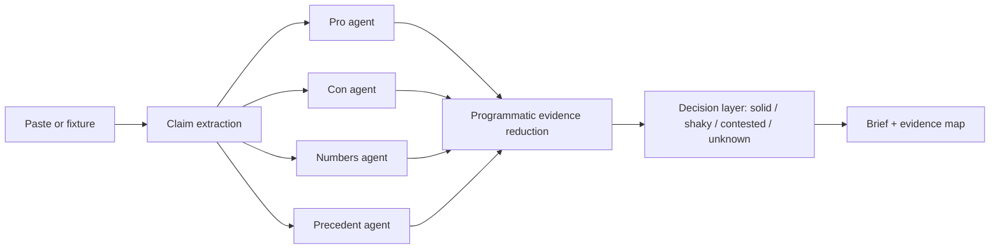

# Actually...

Actually... is an evidence-native research agent for the claims people make too confidently at work. Paste a memo, Slack dump, or AI answer and it turns the fog into a short brief: claim → evidence → grade → next check.

The app includes three starter scenarios, and it can investigate any claim with an OpenAI API key and live web search:

- **Should we migrate payments to Stripe?** — a mixed internal memo.
- **Fact-check this AI strategy answer** — four overconfident claims.
- **Competitor all moved to event-driven architecture** — Slack lore and blog summaries.

## Run it

Requires Node 18+.

```bash
npm install
npm run dev
```

Open `http://localhost:3000`, paste a claim, memo, Slack thread, or AI answer, choose a research lens, and click **Start investigation**. The pipeline shows claim extraction, live web research, evidence reduction, grading, and brief synthesis. Copy markdown and re-check contested claims are included in the results experience.

For live analysis, copy `.env.example` to `.env.local`, set `OPENAI_API_KEY`, and optionally change `OPENAI_MODEL`. The server calls the Responses API with web search enabled, so the key never reaches the browser. `POST /api/analyze` returns the complete typed investigation result.

## Architecture



The live pipeline asks the model to extract claims, search for current evidence, distinguish support from contradiction, grade uncertainty, and return source links. The UI still includes starter scenarios so the product is easy to explore before adding a key.

## Codex + build notes

Codex accelerated the build by scaffolding the Next app, defining the typed claim/evidence shape, generating the replay fixtures, and iterating the complete input → progress → results → export path in one workspace. Key decisions: fixture-first reliability over live search for judging, CSS over a component library to keep the visual identity opinionated, and an explicit decision layer rather than a generic summary.

## Demo script (under 3 minutes)

1. Open the Stripe fixture and point out the mixed claims.
2. Run it: call out the four parallel investigator roles and the five visible stages.
3. On results, show the decisive bottom line, then contrast solid, shaky, contested, and unknown cards.
4. Click **Re-check contested only**, then **Copy markdown**.
5. Return to the home screen and run the AI strategy fixture to show that the system catches absolute language and preserves caveats.
